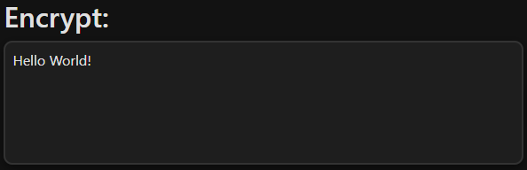
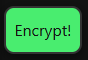
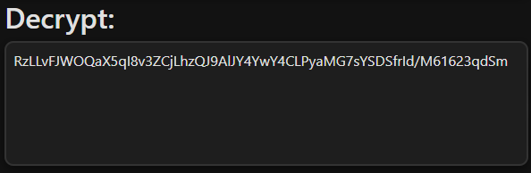
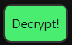

# Cryptography Web UI
A web-based user interface for encrypting and decrypting text to and from AES-256

## Instalation
1. Install python 3.10+
2. Download the code and extract into a folder on your desktop
3. Open the folder in a terminal of choice
4. Create a new python virtual environment using:
```sh
python -m venv venv
```
5. Activate the virtual environment using the activate script found in:
```sh
./venv/Scripts/activate
```
6. Install the required python packages using:
```sh
pip install -r requirements.txt
```
7. Create a new .env file with the items shown in the .env.example file (NOTE: password requirements is 16 characters minimum)
8. Run the application using:
```sh
fastapi run app.py
```
9. The application should now be running and can be visited at:
```
http://0.0.0.0:8000
```

## How to use
1. Go to the url above
2. Enter the text you want to encrypt in the box as shown below   

3. Click the green encrypt button  

4. The encrypted text should now appear in the box as shown below  

5. (Optional) Click the copy button to instantly copy the text to your clipboard  

6. (Optional) Clear the encrypt box and click the green decrypt button to decrypt your text  


## Encryption
This application uses AES-256 to encrypt text, the encrypted bytes are then encoded to base64 which is then decoded to utf-8.

AES-256 in particular was chosen, beyond being a battle-tested industry standard, for being a performant yet secure algorithm. It is well optimized in most modern hard- and software implementations, while it's large 256-bit key makes it practically impossible to crack with current technologies.

## Key
The key consists of a 32 character (256-bit) randomly generated byte array. It is generated at runtime by running a salt and password through a KDF.

### Password
The password for the key is provided through a ``.env`` file by the application owner. The application mandates a minimum password length of 16 characters to ensure a minimum level of security.

### Salt
The salt consists of 16 randomly generated byte array, generated by python's native ``os.urandom`` method. This salt is used to generate a secret key used to encrypt the message, as well as being passed with the encrypted message back to the user. This is done so that during decryption the same salt can be used to generate the decryption key.

### Generation
To generate cryptographically secure keys, this application uses PBKDF2 to generate it's keys. It's strength comes from the hashing algorithm provided as well as the number of iterations and the salt.

A weak hashing alogrithm, low number of iterations, or even a weak salt lessens the effectiveness of a KDF and makes it vulnerable to brute force attacks.

To mitigate this, a strong hashing algorithm (SHA256) is used. It generates for 100.000 iterations, which is a recommended halfway point between performance and security. For truly secure encryption, it is generally recommended to perform 1.000.000 iterations or more, however this will significantly impact the application performance.

The salt is, as explained above, randomly generated and should on it's own not prove to be a security concern in 99.98% of cases.

For further improvement of this system I might consider switching from PBKDF2 to Argon2. Not only is this better against side-channel attacks, it is also slower and more secure than PBKDF2.

## Kerckhoff's principle
To adhere to Kerckhoff's principle a cryptographic system should be secure even if everything about the system, except the key, is public knowledge.

This application meets this on the following fronts:
* Open Source
* Use of an open source encryption implementation
* Secure per-generation random salt
* Password stored in a .env only accessible to the application owner
* Key generated based on secret password and random salt

However some issues may still arise if the password gets leaked or is guessed due to being too weak. To mitigate this risk the app, as spoken about above, mandates a 16 character long password, but recommends using 32 or more characters.

As long as the password remains secret, and the implementations of AES-256 and PBKDF2 by python's cryptography package remain secure, this app adheres to Kerckhoff's principle.